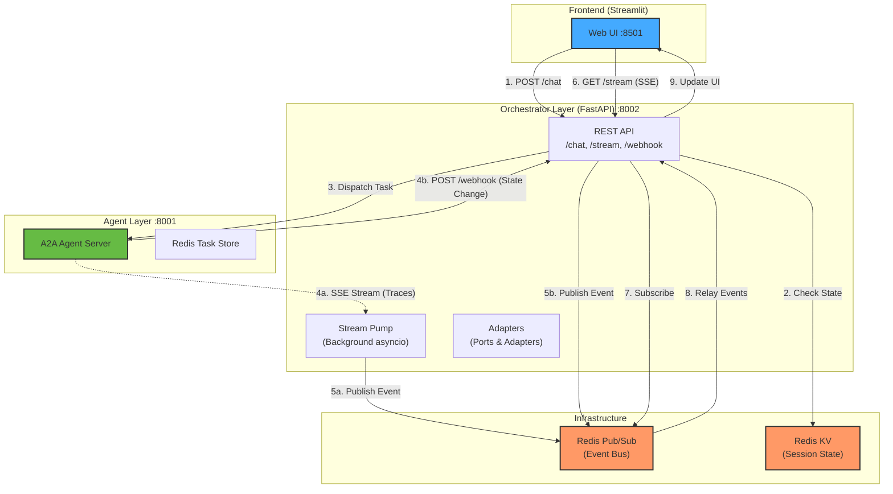

# Event-Driven A2A Orchestrator

A robust, 3-tier integration demonstrating an asynchronous, event-driven orchestration pattern for A2A Agents using **Redis Pub/Sub** and **FastAPI**.

This project decouples the frontend UI from the backend agent execution by introducing an Orchestrator API that handles state management and real-time event relay.

## Architecture: Hybrid Event-Driven

The system uses a **redundant hybrid pattern** for maximum reliability:
1.  **SSE Relay (Live Traces)**: Sub-millisecond updates during active sessions.
2.  **Push Notifications (Webhooks)**: Persistent, stateless callbacks from the Agent for long-running background tasks.



1.  **A2A Agent Server (Port 8001)**: Native agent execution. Now configured with `HttpPushNotificationSender` to ping the Orchestrator on every state change.
2.  **Orchestrator API (Port 8002)**: The stateless hub. Receives both live streams and background webhooks, unifying them in Redis.
3.  **Streamlit UI (Port 8501)**: Consumes the unified event stream from Redis.

## Key Features

- **Decoupled Orchestration**: The UI never talks directly to the Agent Server.
- **Event Relay Pattern**: Orchestrator "pumps" SDK events into Redis Pub/Sub, allowing multiple subscribers and resilient stream handling.
- **Task Persistence**: Supports `input-required` multi-turn prompts by persisting `task_id` and routing follow-up replies to existing background tasks.
- **Pluggable Adapters**: Built with `StateStore` and `MessageBus` ports, currently using `RedisAdapter`.

## Infrastructure

This project requires **Redis** for state and messaging. Run it using Docker:

```bash
docker run -d --name a2a-redis -p 6379:6379 redis:alpine
```

## Setup & Running

This project uses `uv` for dependency management.

### 1. Start the Agent Server
```bash
uv run python -m a2a_server
```

### 2. Start the Orchestrator API
```bash
uv run uvicorn orchestrator_api.main:app --port 8002
```

### 3. Start the Streamlit UI
```bash
uv run streamlit run streamlit_client.py
```

## Using the UI

1. **New Session**: Generates a fresh UUID in the sidebar.
2. **Streaming Mode**: Real-time `st.status` traces powered by Redis SSE.
3. **Artifacts**: Automatic extraction and rendering of structured data produced by the agent.
4. **Context Recovery**: Responding to an "Input Required" prompt preserves the background task context.
