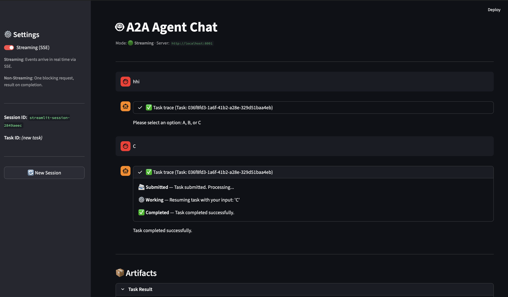

# A2A Agent Setup

A minimalist, SDK-native integration demonstrating how to connect a custom backend agent with a generic client UI using the `a2a-sdk`.

This project has been heavily refactored to remove all custom bridging models, Redis reliance, and boilerplate orchestrators in favor of pure A2A native `Message`, `Task`, and `Part` primitives.

## Streamlit Interface

> *Built-in support for live status traces and file/JSON attachments.*



## Architecture

Here is a high-level overview of the components and data flow:

```mermaid
sequenceDiagram
    participant UI as Streamlit UI
    participant Client as A2A ClientFactory
    participant API as FastAPI Server
    participant Agent as AgentExecutor

    UI->>Client: Chat Text, JSON, Files
    Client->>Client: Pack into A2A Message (TextPart, DataPart, FilePart)
    
    rect rgb(20, 50, 80)
    Note right of Client: HTTP POST / Server-Sent Events (SSE)
    Client->>API: send_message()
    API->>Agent: execute()
    end
    
    Agent-->>API: yield TaskStates (working, input_required, completed)
    Agent-->>API: yield Artifacts (DataPart containing task_id, etc)
    API-->>Client: Stream SSE Events
    Client-->>UI: Stored in st.session_state & rendered via st.status
```



The project contains two main architectural components:

### 1. The Agent Server (`a2a_server/`)
The "brain". It runs an A2A standard FastAPI server, exposing the underlying execution logic via an `AgentExecutor`.
- **`executor.py`:** Contains the `AgentExecutor.execute()` logic handling state transitions (`NEW`, `input_required`, `completed`), processing incoming `TextPart`, `DataPart`, and `FilePart` data, and generating `DataPart` structured artifacts.
- **`__main__.py`:** Boots up the native A2A `DefaultRequestHandler` and `FastAPIAppBuilder` to serve the API on `localhost:8001`.

### 2. The Client
The "face", pretending to be a generic orchestrator.
- **`a2a_client.py`:** A low-level Python script utilizing the A2A `ClientFactory` to communicate with the server. It handles packing user chat texts, JSON blobs, and base64-encoded file bytes straight into standard A2A `Message` objects.
- **`streamlit_client.py`:** A full-featured Streamlit chat UI that leverages `a2a_client.py`. It supports:
  - Persistent chat history and trace logs
  - Live Server-Sent Events (SSE) streaming updates via an interactive `st.status` expander
  - Support for `input_required` conversational multi-turn prompts
  - File/Data generic upload handling

## Supported Execution Modes

Because Streamlit is a frontend UI script, the SDK interacts with the A2A Server using the following two native connection methods:

1. **Streaming (SSE):** The recommended user-experience method. Streamlit opens a single HTTP connection and holds it open, listening to `yield` events (working, completed, artifacts) as they happen in real-time.
2. **Blocking / Polling (Non-Streaming):** Streamlit makes a standard synchronous HTTP request and awaits the final Task completion object. In larger asynchronous setups, this is typically wrapped in a `while True: time.sleep(2)` loop to poll the `GET /tasks/{task_id}` endpoint.

> **Note on Push Notifications (Webhooks):** The A2A SDK natively supports `PushNotificationConfig` to automatically fire webhook HTTP `POST` requests to an external server when long-running background tasks reach new states. Because a frontend like Streamlit cannot spin up an inbound web server listener to catch these webhooks, implementing true "Fire-and-Forget" push notification architecture requires standing up a lightweight orchestrator API specifically to act as the middleman to collect those results and store them in a database.

## Running the Application

This project uses `uv` for fast dependency management and execution.

### Terminal 1: Start the Agent API
```bash
uv run python -m a2a_server
```
Runs the A2A backend on `http://localhost:8001`.

### Terminal 2: Start the Streamlit UI
```bash
uv run streamlit run streamlit_client.py
```
Open your browser to the URL provided by Streamlit (usually `http://localhost:8501`).

## Using the UI

1. **Streaming vs Non-Streaming:** Use the toggle in the sidebar to switch between receiving SSE real-time state updates (Live Traces) vs one blocking HTTP call (No Traces).
2. **Multi-turn Tasks:** Send a message like "Hi". The agent will respond asking "Please select an option: A, B, or C". You can reply to continue the specific `task_id`.
3. **Attachments:** Before sending a message, use the built-in expanders to upload a file or define a JSON dict. These are packed natively into `FilePart` and `DataPart` arrays and read transparently by the executing agent.
